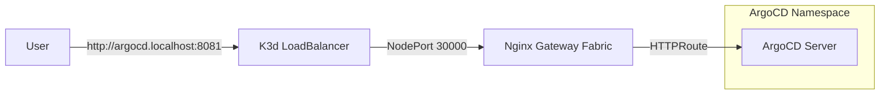

# ArgoCD Setup Guide with Gateway API

This guide details how to deploy ArgoCD and expose it using the Kubernetes Gateway API. It covers both the current local **k3d** environment and adaptation for **Real Cloud Providers**.

## 1. Local Setup (k3d)

In this setup, we assume access is through `localhost` mapped via k3d's proxy load balancer.

### Prerequisites
- Kubernetes Cluster (k3d) running.
- **Tools**: `kubectl`, `helm`, `argocd`.

> **Tip**: Install tools easily with **Arkade**:
> ```bash
> curl -sLS https://get.arkade.dev | sudo sh
> arkade get k3d kubectl helm argocd
> ```

### Installation Steps

1.  **Run the Setup Script (Kustomize)**
    This script installs ArgoCD using Kustomize (`argocd-install/`) and patches it to run in "insecure" mode (HTTP).
    ```bash
    ./setup-argocd.sh
    ```
    *Files used:*
    *   `argocd-install/kustomization.yaml`: Main declaration.
    *   `argocd-install/server-insecure-patch.yaml`: Patch for `--insecure`.

2.  **Bootstrap Gateway (GitOps)**
    We use ArgoCD to install the Gateway infrastructure (CRDs + Nginx Fabric).
    ```bash
    kubectl apply -f gitops/
    ```
    *This creates two ArgoCD Applications:*
    *   `gateway-api-crds`: Installs experimental CRDs.
    *   `nginx-gateway-fabric`: Installs the controller (NodePort 30000).

3.  **Deploy the Route**
    Apply the HTTPRoute to route traffic from the Gateway to ArgoCD.
    ```bash
    kubectl apply -f manifests/argocd-route.yaml
    ```

4.  **Configure DNS (Local)**
    Since we are using `argocd.localhost`, ensure it resolves to `127.0.0.1`.
    Add this to your `/etc/hosts` (Linux/macOS) or `C:\Windows\System32\drivers\etc\hosts` (Windows):
    ```text
    127.0.0.1 argocd.localhost
    ```

5.  **Access ArgoCD**
    - **URL**: [http://argocd.localhost:8081](http://argocd.localhost:8081)
    - **Get Password**:
      ```bash
      kubectl -n argocd get secret argocd-initial-admin-secret -o jsonpath="{.data.password}" | base64 -d && echo ""
      ```
    - **User**: `admin`

### Local Topology



---

## 2. Real Cloud Provider Setup (AWS, GCP, Azure, etc.)

When moving to a real cloud environment (EKS, GKE, AKS, or Civo/DigitalOcean), the core concepts remain the same, but the **Exposure** and **TLS** handling change.

### Key Differences
1.  **LoadBalancer IP**: Cloud providers give you a real Public IP or Hostname for your Gateway Service.
2.  **DNS**: You use real DNS records (A or CNAME) instead of `/etc/hosts`.
3.  **TLS**: You should use **Cert-Manager** to automatically provision valid SSL certificates (Let's Encrypt).

### Step-by-Step Production Guide

#### 1. Install Gateway API & Controller
Install your chosen Gateway implementation (Nginx, Istio, Cilium, or Cloud-native Gateway like AWS Lattice/GKE Gateway).
```bash
# Example: Nginx Gateway Fabric (Standard)
helm install ngf oci://ghcr.io/nginxinc/charts/nginx-gateway-fabric \
    --namespace nginx-gateway --create-namespace \
    --set service.type=LoadBalancer
```
*Wait for the Service to get an External IP.*

#### 2. Install ArgoCD
Install ArgoCD standard. **You do NOT need to run it in insecure mode** if you use "Passthrough" TLS, but for standard Gateway API HTTPRoute (Termination at Gateway), running **insecure** is still common easier.

**Option A: Termination at Gateway (Recommended)**
- Gateway handles HTTPS.
- Gateway talks to ArgoCD via HTTP.
- Requires ArgoCD to be patched with `--insecure` (same as local setup).

**Option B: Passthrough (Complex)**
- Gateway passes encrypted TCP traffic.
- ArgoCD handles TLS.
- Requires `TLSRoute` instead of `HTTPRoute`.

#### 3. Configure DNS
Point your domain (e.g., `argocd.example.com`) to the **External IP** of your Gateway Service.

#### 4. Secure with Cert-Manager (TLS)
Deploy Cert-Manager and a ClusterIssuer.

**Gateway Resource Update:**
Add a listener for HTTPS and attach the certificate issuer.

```yaml
apiVersion: gateway.networking.k8s.io/v1
kind: Gateway
metadata:
  name: cloud-gateway
  namespace: default
  annotations:
    cert-manager.io/cluster-issuer: letsencrypt-prod # Auto-create Certs
spec:
  gatewayClassName: nginx
  listeners:
  - name: https
    port: 443
    protocol: HTTPS
    hostname: "*.example.com"
    tls:
      mode: Terminate
      certificateRefs:
      - name: gateway-tls-cert
    allowedRoutes:
      namespaces:
        from: All
```

#### 5. HTTPRoute for Cloud
Update the Hostname to your real domain.

```yaml
apiVersion: gateway.networking.k8s.io/v1
kind: HTTPRoute
metadata:
  name: argocd-route
  namespace: argocd
spec:
  parentRefs:
  - name: cloud-gateway
    namespace: default
  hostnames:
  - "argocd.example.com"
  rules:
  - matches:
    - path:
        type: PathPrefix
        value: /
    backendRefs:
    - name: argocd-server
      port: 80
```

### Production Topology

```mermaid
graph LR
    User -->|https://argocd.example.com| CloudLB["Cloud LoadBalancer"]
    CloudLB -->|Public IP| NGF["Gateway Controller"]
    NGF -- "Terminates TLS" --> |HTTP| ArgoServer["ArgoCD Server"]
    
    subgraph "Cluster"
        NGF
        ArgoServer
    end
```
