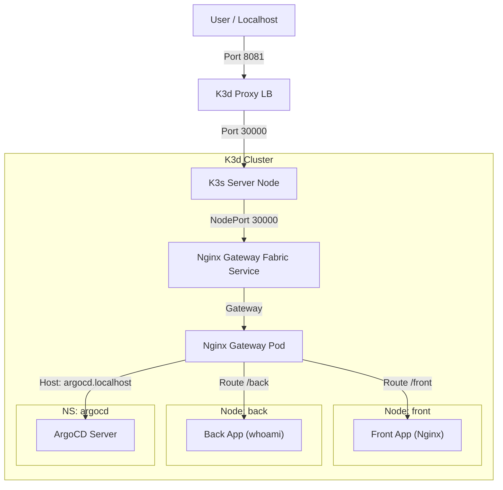

# K3d Gateway API Demo

This project sets up a local Kubernetes cluster using `k3d` with the following characteristics:
- **Declarative Configuration**: Defined in `k3d-config.yaml`.
- **2 Worker Nodes**: Labeled `nodetype=front` and `nodetype=back`.
- **No Default LoadBalancer/Ingress**: Built-in Traefik and ServiceLB are disabled.
- **Gateway API**: Uses Nginx Gateway Fabric exposed via NodePort (Managed by GitOps).
- **Local Access**: Services accessible via `localhost:8081` (mapped to NodePort 30000).

## Topology



## Folder Structure

- `bootstrap/`: ArgoCD initial installation manifests.
- `gitops/`: ArgoCD Applications (The Control Plane).
  - `core/`: Infrastructure Apps (Gateway API, Nginx Gateway).
  - `apps/`: (Optional) Business Logic Apps.
- `manifests/`: Raw Kubernetes Manifests.
  - `infra/`: Gateway definitions.
  - `workloads/`: Application Deployments (Front/Back).
  - `routes/`: HTTPRoutes.
- `scripts/`: Helper scripts.

## Setup Guide

### Prerequisites
- [k3d](https://k3d.io/) installed
- [kubectl](https://kubernetes.io/docs/tasks/tools/) installed
- [helm](https://helm.sh/) installed

### Steps

1. **Create the Cluster**
   ```bash
   k3d cluster create --config k3d-config.yaml
   ```

2. **Run the Setup Script**
   This script installs ArgoCD, the Gateway Infrastructure, and deploys the demo apps.
   ```bash
   ./setup.sh
   ```

3. **Access the Services**
   - **Front App**: [http://localhost:8081/front](http://localhost:8081/front)
   - **Back App**: [http://localhost:8081/back](http://localhost:8081/back)
   - **ArgoCD**: [http://argocd.localhost:8081](http://argocd.localhost:8081)
     *   *Credential*: User `admin`
     *   *Password*: Run `kubectl -n argocd get secret argocd-initial-admin-secret -o jsonpath="{.data.password}" | base64 -d`

## HTTPS Setup

This project includes HTTPS support using cert-manager with self-signed certificates.

### Components

| File | Description |
|------|-------------|
| `manifests/infra/cluster-issuer.yaml` | Self-signed ClusterIssuer for cert-manager |
| `manifests/infra/app001-certificate.yaml` | TLS Certificate for `app001.localhost` |
| `manifests/infra/gateway.yaml` | Gateway with HTTP (80) and HTTPS (443) listeners |

### Setup HTTPS

```bash
# 1. Ensure cert-manager is installed (via ArgoCD)
kubectl get pods -n cert-manager

# 2. Apply ClusterIssuer
kubectl apply -f manifests/infra/cluster-issuer.yaml

# 3. Apply Certificate
kubectl apply -f manifests/infra/app001-certificate.yaml

# 4. Apply Gateway (if not already)
kubectl apply -f manifests/infra/gateway.yaml

# 5. Verify certificate is ready
kubectl get certificate -n default
kubectl get secret app001-tls-secret -n default
```

### Access via HTTPS

**Option 1: Using port-forward (recommended for existing cluster)**
```bash
kubectl port-forward svc/nginx-gateway-fabric -n nginx-gateway 8443:443
# Access: https://app001.localhost:8443 (accept self-signed cert warning)
```

**Option 2: Recreate cluster with HTTPS port (for new cluster)**
```bash
# Delete and recreate cluster with updated k3d-config.yaml
k3d cluster delete k3d-gateway-demo
k3d cluster create --config k3d-config.yaml
./setup.sh
# Access: https://app001.localhost:8443
```

> **Note**: Since we use self-signed certificates, your browser will show a security warning. Click "Advanced" → "Proceed" to access the site.

## Cleaning Up

To delete the cluster and remove all resources:

```bash
./scripts/cleanup.sh
```


