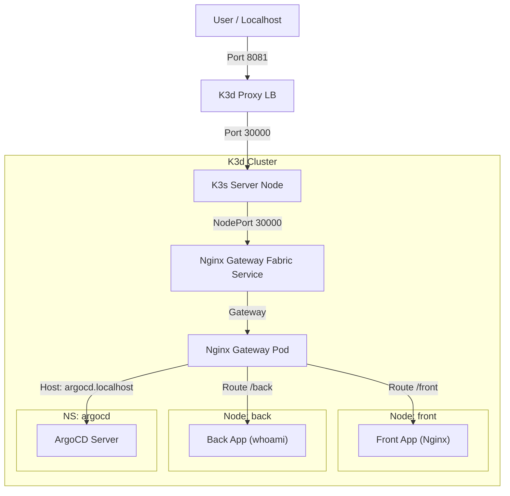

# K3d Gateway API Demo

This project sets up a local Kubernetes cluster using `k3d` with the following characteristics:
- **Declarative Configuration**: Defined in `k3d-config.yaml`.
- **2 Worker Nodes**: Labeled `nodetype=front` and `nodetype=back`.
- **No Default LoadBalancer/Ingress**: Built-in Traefik and ServiceLB are disabled.
- **Gateway API**: Uses Nginx Gateway Fabric exposed via NodePort (Managed by GitOps).
- **Local Access**: Services accessible via `localhost:8081` (mapped to NodePort 30000).

## Topology



## Setup Guide

### ⚡ Pro Tip: Quick Tool Setup with Arkade
Don't have the tools installed? You can use [Arkade](https://github.com/alexellis/arkade) to install everything quickly.

1. **Install Arkade**:
   ```bash
   curl -sLS https://get.arkade.dev | sudo sh
   ```
2. **Install Required Tools**:
   ```bash
   arkade get k3d
   arkade get kubectl
   arkade get helm
   arkade get argocd
   ```

### Prerequisites
- [k3d](https://k3d.io/) installed
- [kubectl](https://kubernetes.io/docs/tasks/tools/) installed
- [helm](https://helm.sh/) installed

### Steps

1. **Create the Cluster**
   ```bash
   k3d cluster create --config k3d-config.yaml
   ```

2. **Install ArgoCD (Core)**
   We install ArgoCD first because we use it to manage the Gateway installation (**GitOps**).
   The setup uses **Kustomize** (`argocd-install/`) for declarative configuration.
   ```bash
   chmod +x setup-argocd.sh
   ./setup-argocd.sh
   ```

3. **Install Gateway API (GitOps)**
   Bootstrap the Gateway infrastructure (CRDs and Nginx Controller) using ArgoCD Applications.
   ```bash
   kubectl apply -f gitops/
   ```
   *You can check the sync status in the ArgoCD UI or via `kubectl get app -n argocd`.*

4. **Deploy Apps & Routes**
   Apply the dummy applications and the Gateway API routes.
   ```bash
   kubectl apply -f manifests/apps-and-routes.yaml
   ```

5. **Expose ArgoCD**
   Apply the HTTPRoute to expose ArgoCD itself via the Gateway.
   ```bash
   kubectl apply -f manifests/argocd-route.yaml
   ```

6. **Access the Services**
   - **Front App**: [http://localhost:8081/front](http://localhost:8081/front)
   - **Back App**: [http://localhost:8081/back](http://localhost:8081/back)
   - **ArgoCD**: [http://argocd.localhost:8081](http://argocd.localhost:8081)
     *   *Credential*: User `admin`
     *   *Password*: Run `kubectl -n argocd get secret argocd-initial-admin-secret -o jsonpath="{.data.password}" | base64 -d`

## Troubleshooting
- **Address already in use**: If k3d fails to start, check if port 8081 is free.
- **Connection Refused**: Ensure the `nginx-gateway` service has `NodePort` 30000 and the k3d LB is running.
- **404 Not Found**: The Gateway is reachable but the route is not matching. Check `kubectl get httproute`.
